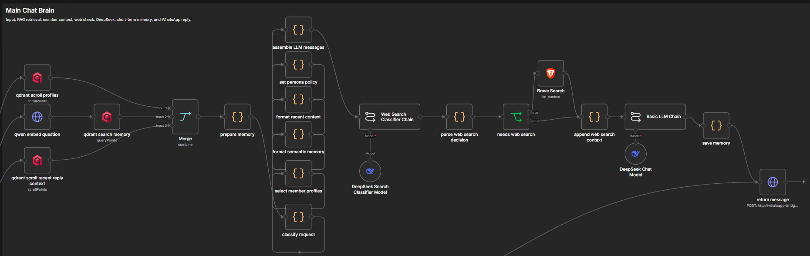

# n8n RAG WhatsApp Chatbot Better Version

A WhatsApp group AI assistant built with **n8n**, **Qdrant**, **DeepSeek**, **Qwen embeddings**, and optional **Brave Search**.

It can answer group messages, retrieve long-term chat memory, use member profiles for context, search the web when needed, and write new WhatsApp memories back into Qdrant.



## Features

- WhatsApp group chatbot powered by n8n workflows
- RAG memory retrieval with Qdrant
- Qwen embedding-based semantic search
- Member profile and group context support
- Recent chat context for natural replies
- DeepSeek LLM response generation
- Optional Brave Search web context
- Memory write-back into Qdrant
- Settings endpoint for allowed WhatsApp groups

## Architecture

```text
WhatsApp message
-> Embedding
-> Qdrant memory search
-> Member profile context
-> Recent reply context
-> Web-search decision
-> DeepSeek response
-> Save short-term memory
-> Reply to WhatsApp
```

The main n8n workflow is exported here:

```text
n8n/workflows/n8n-rag-whatsapp-chatbot-better-version.json
```

## Services

The included Docker Compose setup runs:

- `whatsapp-bridge`, WhatsApp Web bridge and HTTP API
- `n8n`, workflow automation
- `qdrant`, vector database for memory

## Required environment variables

Create a local `.env` file. Do not commit it.

```text
EMBEDDING_URL: your embedding endpoint
EMBEDDING_API_KEY: your embedding provider key
EMBEDDING_MODEL: text-embedding-v4
BRAVE_SEARCH_API_KEY: your Brave Search key, optional
```

Other LLM provider keys can be added depending on your n8n credentials and selected models.

## Run locally

```powershell
docker compose up -d
```

Then open:

```text
http://localhost:5678
```

Import the workflow JSON from:

```text
n8n/workflows/n8n-rag-whatsapp-chatbot-better-version.json
```

## WhatsApp bridge

Start the bridge and scan the WhatsApp Web QR code from the container logs:

```powershell
docker logs -f whatsapp-bridge
```

Allowed groups can be managed from:

```text
http://localhost:3000/settings
```

## Test

```powershell
npm test
```

## Notes

- Secrets, credentials, `.env`, local n8n databases, and Qdrant storage should stay out of Git.
- The screenshot was captured from the n8n canvas. n8n exports workflow JSON officially, but it does not provide a dedicated polished screenshot export.
